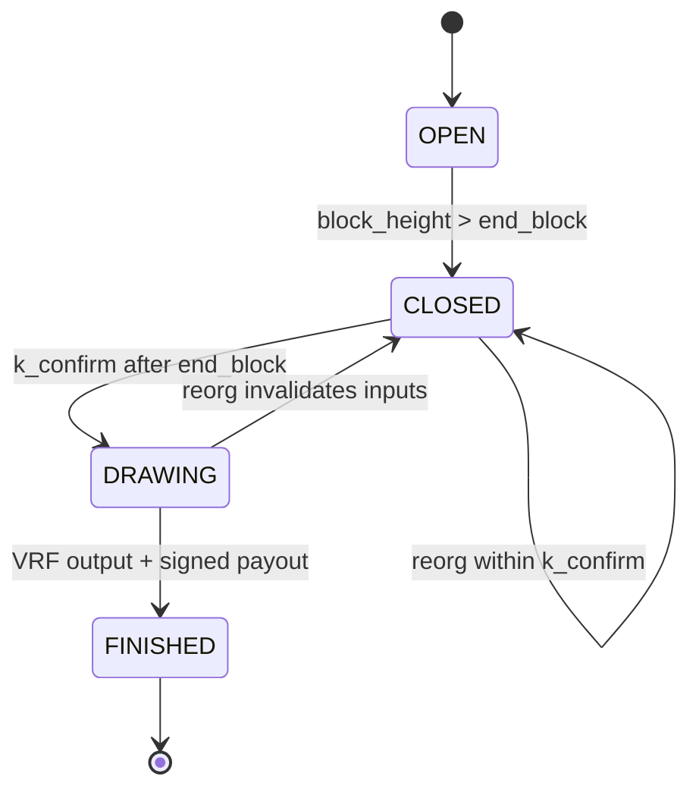

# Round Lifecycle State Machine

## Abstract
This document defines the deterministic lifecycle of a Bittery round, including state transitions, triggers, and handling of reorgs or failures. The lifecycle ensures every participant can reproduce when bets are valid, when randomness is drawn, and when payouts are finalized.

## Motivation
A clear state machine enables independent validators to reach the same conclusion about round status using only on-chain data plus the BII ruleset. Explicit transitions also make failure recovery and reorg handling deterministic.

## Specification
### States
- **OPEN**: Bets are accepted. Height window: `start_block ≤ block_height ≤ end_block` from the BII.
- **CLOSED**: Betting window has ended, awaiting confirmations before drawing randomness.
- **DRAWING**: VRF randomness is executed and winners are selected.
- **FINISHED**: Payout transaction is constructed, signed via TSS, and broadcast.

### Transitions
1. **INIT → OPEN**: Implicit when BII is anchored and the blockchain reaches `start_block`.
2. **OPEN → CLOSED**: Occurs when the first block higher than `end_block` is observed. Bets in blocks above `end_block` are ineligible.
3. **CLOSED → DRAWING**: After `k_confirm` blocks (default 6) have confirmed the block containing `end_block`, the ICP final judge begins VRF execution using the confirmed block hash set.
4. **DRAWING → FINISHED**: After VRF output is generated and winners are selected, the TSS payout transaction is assembled and signed. Broadcast triggers entry to FINISHED once a transaction ID exists.
5. **FINISHED**: Terminal state. Any rollover funds are locked to the next round according to BII rules.

### Reorg Handling
- If a reorg changes blocks within the `k_confirm` window after `end_block`, the state reverts to CLOSED and bet eligibility is recomputed using the new chain view.
- If a reorg occurs after entering DRAWING but before FINISHED, randomness MUST be recomputed using the new confirmed block hash set to maintain reproducibility.
- If a payout transaction was already broadcast and becomes invalid due to reorg, a new payout transaction MUST be generated with updated inputs; superseded payouts are marked obsolete.

### Failure Recovery
- If TSS signing fails, the system remains in DRAWING and retries until quorum signatures are obtained or a termination instruction is validated.
- If VRF service is unavailable, the state remains CLOSED until VRF output is produced. No bets are accepted after CLOSED regardless of delay.
- Termination signals (`op=2`) in OP_RETURN may accelerate closure but MUST still respect block-based state transitions.

### Required Confirmations
- `k_confirm` (default 6) is applied after `end_block` before randomness is derived.
- Additional confirmations for payout finality are implementation-specific but SHOULD be at least 1 block after broadcasting.

### State Diagram

## Data Structures
- `RoundState`: {state, round_id, last_block_seen, k_confirm, vrf_seed, payout_txid}
- `BetLedger`: ordered list of eligible bets as of CLOSED, recomputed on reorg.

## Validation
- Validators MUST only accept bets observed while state is OPEN.
- VRF execution MUST use the highest block at height `end_block` after `k_confirm` confirmations.
- Payout transactions MUST reference the bet set frozen at the transition to DRAWING.

## Rationale
The four-state machine balances simplicity with deterministic handling of Bitcoin-specific uncertainties such as reorgs and confirmation depth. Explicit recomputation rules preserve reproducibility across independent verifiers.

## Security Considerations
- **Reorg safety**: Recomputing eligibility and VRF inputs after reorgs prevents divergent outcomes.
- **Finality**: Waiting `k_confirm` reduces risk of including bets from transient forks.
- **Liveness**: DRAWING persists until successful TSS signing, preventing premature termination.
